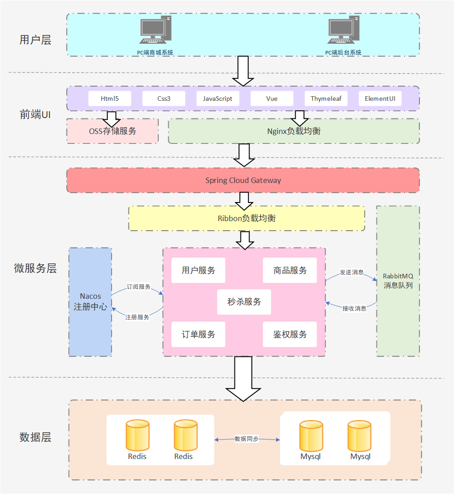
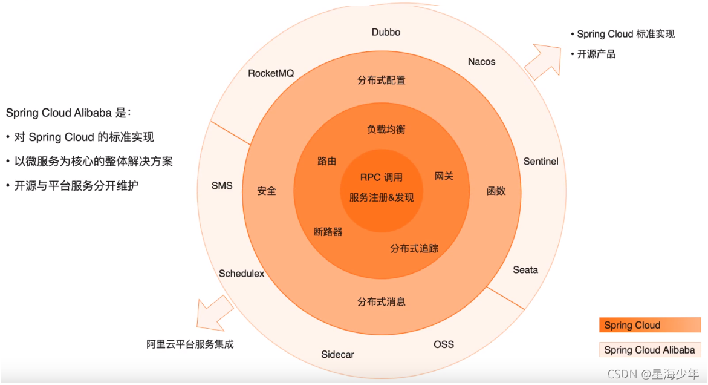

# Seckill

#### 介绍
suron-高并发秒杀系统
网址：[http://www.suron.com.cn](http://www.suron.com.cn) (备案中)

#### 软件架构
软件架构说明

#### 关键技术点
1. 缓存预热：在秒杀活动开始前，将商品信息和库存数据预加载到Redis中，利用内存标记减少对Redis的访问，减轻数据库压力，提高响应速度。
2. 限流：在API网关层使用Redis计数器进行全局限流，而在具体的服务层使用令牌桶进行更细粒度的控制。
3. 分布式锁：使用Redis 分布式锁保证扣减库存和下单的原子性，使用lua脚本避免超卖的发生。
4. 异步处理：利用RabbitMQ消息队列将用户请求异步化，后台服务逐一处理队列中的请求，避免瞬时高并发直接冲击数据库。
#### 系统工作流程

    系统工作流程
    请求接收：用户在前端点击秒杀按钮，Nginx将请求转发到应用层。
    参数校验：Controller层接收请求并进行参数校验，验证码校验，通过后将请求转发给Service层。
    库存检查：Service层首先在Redis缓存中检查库存，若库存充足则继续处理，否则直接返回秒杀失败。
    订单生成：若库存充足，Service层通过RabbitMQ将请求放入消息队列，立即返回请求已接收的响应。
    异步处理：后台服务从RabbitMQ队列中取出请求，进一步检查库存，减少库存并生成订单，将订单信息保存到MySQL数据库。
    数据更新：将库存和订单信息更新到数据库和缓存中，保证数据一致性。
    反馈结果：前端轮询方式获取订单生成结果，通知用户秒杀成功或失败。

#### 使用说明

1.  点击右上角“请登录”
2.  输入用户名，密码：13388584660 13388584660
3.  点击下方秒杀专区即可体验

#### 致谢

1. [renren_fast_vue](https://gitee.com/renrenio/renren-fast-vue) 前后端分离的后台管理系统-前端
2. [renren_fast](https://gitee.com/renrenio/renren-fast) 前后端分离的后台管理系统-后端
3. 相关网络资料
** **
####

